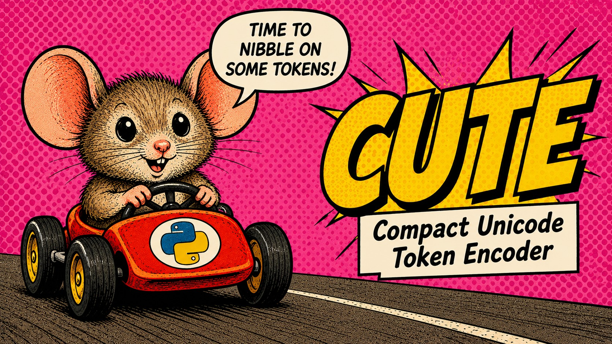

<p align="center">
  
</p>

<h1 align="center">CUTE</h1>
<h3 align="center"><em>Compact Unicode Token Encoding</em></h3>
<p align="center"><strong>Semantic-Anchored Byte-level BPE for source code</strong></p>

<p align="center">
  <a href="https://www.python.org/">
    
  </a>
  <a href="LICENSE">
    
  </a>
  <a href="https://huggingface.co/HusseinEid/cute-tokenizer">
    
  </a>
  <a href="https://pypi.org/project/cute-tokenizer/">
    
  </a>
  <a href="https://github.com/HusseinEid101/CUTE/actions">
    
  </a>
</p>

---

## Overview

CUTE is a code-aware tokenizer built on a single architectural idea:
**substitute high-savings multi-byte patterns to atomic Unicode
codepoints *before* byte-level BPE sees them.** The result is a
tokenizer that, on real-world Python source, produces fewer tokens
per file than any of the nine baselines we benchmark — including
OpenAI's `cl100k_base` and `o200k_base`, LLaMA-3's SentencePiece BPE,
and three SentencePiece Unigram variants — while preserving
byte-equal roundtrip on every input.

### How it works

1. A frequency-weighted, savings-ranked selection pass mines
   high-value multi-byte patterns (identifiers, common slices like
   `(self`, `=None`, `:\n`) from a code corpus.
2. Selected patterns are mapped one-to-one to **supplementary-plane
   Private-Use-Area (PUA) codepoints** (`U+F0000+`). The BMP-PUA
   range is deliberately skipped to avoid colliding with literal
   PUA characters that appear in real source code.
3. A byte-level BPE trainer runs on the **PUA-pre-substituted
   stream**, so semantic anchors are visible to the merge algorithm
   and can compose freely with whitespace and punctuation
   (e.g. `Ġ + ⟦def⟧`, `⟦return⟧ + Ġ`).
4. A second savings pass adds the top-N high-frequency compound
   patterns (`)\n`, `(self,`, `.append`) as atomic `AddedToken`s.
5. At encode time, an Aho-Corasick (leftmost-longest) Rust pass
   substitutes PUA codepoints; a purpose-built Rust BPE encoder
   (`cute-bpe`, modeled on tiktoken's linear-scan-min-rank merge
   loop) then performs the byte-level BPE pass.
6. At decode time, the inverse PUA map restores the original source
   text — byte-for-byte identical.

### Results (1,500-file Python holdout, The Stack)

| Tokenizer | mean tokens | bytes/tok | vs CUTE | encode p50 | decode p50 | roundtrip |
|---|---:|---:|---:|---:|---:|:---:|
| **CUTE** | **1,767** | **4.42** | — | 1,526 µs | **146 µs** | **1500 / 1500** |
| OpenAI cl100k_base | 1,874 | 4.17 | +6.0% | **552 µs** | **56 µs** | 1500 / 1500 |
| OpenAI o200k_base | 1,886 | 4.14 | +6.7% | 746 µs | 63 µs | 1500 / 1500 |
| LLaMA-3 (SentencePiece BPE) | 1,872 | 4.17 | +5.9% | 1,427 µs | 326 µs | 686 / 1500 |
| StarCoder2 | 2,210 | 3.53 | +25.1% | 1,461 µs | 258 µs | 685 / 1500 |
| XLM-RoBERTa (SentencePiece Unigram) | 2,438 | 3.20 | +38.0% | 1,988 µs | 262 µs | 0 / 1500 |
| CodeLlama | 2,573 | 3.03 | +45.6% | 5,120 µs | 2,417 µs | 1493 / 1500 |
| T5 (SentencePiece Unigram) | 2,706 | 2.89 | +53.2% | 1,803 µs | 273 µs | 0 / 1500 |
| GPT-2 | 3,581 | 2.18 | +102.7% | 2,043 µs | 396 µs | 1500 / 1500 |

Lower mean tokens is better. `vs CUTE` is the extra cost the baseline
pays per file; LLM API spend is linear in this number. Latency
measured on a 1.7 KB Python sample (single-file p50). Roundtrip is
the count of files that re-encode to byte-identical source after
decode.

### What CUTE wins and where it loses

- **Compression: wins everywhere.** Fewer tokens per file than every
  baseline — by 6.0% vs cl100k_base, 6.7% vs o200k_base, 5.9% vs
  LLaMA-3's SentencePiece BPE, and 25–53% vs the StarCoder2 /
  SentencePiece-Unigram family.
- **Roundtrip integrity: wins everywhere.** The only tokenizer in
  this comparison that re-encodes 1,500 / 1,500 files byte-identically.
  LLaMA-3, StarCoder2, XLM-RoBERTa, T5, and CodeLlama each drop or
  corrupt at least some files.
- **Decode latency: 3rd of 9.** 146 µs p50 — behind only OpenAI's
  cl100k (56 µs) and o200k (63 µs), faster than every open-source
  baseline.
- **Encode latency: *does not* beat tiktoken.** End-to-end p50 is
  1,526 µs, vs cl100k's 552 µs — roughly 2.8× slower. The `cute-bpe`
  core encoder is competitive (~259 µs), but the PUA pre-substitution
  pass + Python FFI boundary close the gap by ~1,250 µs. CUTE is
  faster than CodeLlama, GPT-2, T5, and XLM-RoBERTa, and within ~7%
  of LLaMA-3 and StarCoder2 — but tiktoken's encode remains the
  speed leader. If your bottleneck is encoder throughput on
  short prompts, cl100k is the better choice; if your bottleneck is
  context-window budget or roundtrip safety on code, CUTE wins.
- **Determinism.** Byte-identical `tokenizer.json` within a fixed
  `(OS, python, tokenizers, _accel)` host triple. Cross-platform
  byte-identity of trained artifacts is explicitly *not* part of
  the contract.
- **HuggingFace compatibility.** Drop-in `AutoTokenizer.from_pretrained`
  via `trust_remote_code=True`.

Reproduce locally:

```bash
python -m benchmarks.runner \
    --tokenizer ./model \
    --holdout ./your-holdout-corpus \
    --output reports/mine
```

---

## Install

```bash
pip install cute-tokenizer
```

The wheel ships a pretrained 200k-vocab tokenizer. No training required.

```python
from cute_tokenizer import load_default_tokenizer

tok = load_default_tokenizer()
ids = tok("def hello(): return 42", add_special_tokens=False).input_ids
text = tok.decode(ids, skip_special_tokens=True)
assert text == "def hello(): return 42"
```

For tight inference loops where `BatchEncoding` machinery is overhead,
use the `fast_encode` / `fast_decode` methods — these go directly to
the Rust `cute-bpe` encoder/decoder, skipping HuggingFace's wrapper:

```python
ids = tok.fast_encode("def hello(): return 42")
text = tok.fast_decode(ids)
```

### Load via HuggingFace Hub

```python
from transformers import AutoTokenizer

tok = AutoTokenizer.from_pretrained(
    "HusseinEid/cute-tokenizer",
    trust_remote_code=True,
)
```

`trust_remote_code=True` is required because the wrapper class
(`CUTETokenizerFast`) runs the PUA pre-substitution pass before
delegating to the byte-level BPE encoder.

### Train on your own corpus

```bash
pip install 'cute-tokenizer[baseline]'   # pulls tiktoken for cl100k-aware ranking
cute build --corpus ./corpus --output ./output
```

```python
from cute_tokenizer import CUTETokenizerFast

tok = CUTETokenizerFast(
    tokenizer_file="./output/tokenizer.json",
    cute_mapping_file="./output/cute_mapping.json",
)
```

---

## Architecture

CUTE's training pipeline:

1. **Corpus ingest.** Streaming dedup by content hash, secret scrub
   (AWS / OpenAI / Anthropic / GitHub keys, JWTs, PEM private keys),
   optional license filter, deterministic gzipped shards.
2. **Frequency mining.** Parallel multiprocess token counter with
   identifier sub-part boosting (camelCase / snake_case / SCREAMING_CASE).
3. **Savings-based selection.** For each candidate token, compute
   `score = frequency × max(0, cl100k_count − 1)`. Tokens whose
   cl100k cost is 1 (single-byte ASCII like `(`, `,`) score zero —
   byte fallback already handles them optimally. Hashes / UUIDs /
   base64 blobs are filtered out by shape.
4. **PUA assignment.** Selected tokens are mapped to unique
   supplementary-plane PUA codepoints (`U+F0000+`). The BMP-PUA
   range (`U+E000`–`U+F8FF`) is deliberately skipped because real
   source code occasionally contains literal BMP-PUA characters
   (Asian fonts, Unicode mapping tables in TypeScript/JavaScript)
   that would otherwise cause decode-time collisions.
5. **PUA-pre-substituted BPE training.** The training stream is
   PUA-substituted *before* the trainer sees it, so byte-level BPE
   learns merges like `[Ġ][⟦return⟧]` (whitespace + anchor) and
   `[⟦def⟧][Ġ]` natively. PUA codepoints also seed
   `initial_alphabet` so any unselected anchor still has an atomic
   vocab id.
6. **Atomicity audit.** After training, `merge_policy` walks the
   tokenizer JSON and (under `strict_pua_atomicity`) drops any
   PUA + PUA merges. Four invariants are asserted on every save:
   model is `BPE`, decoder is `ByteLevel`, pre-tokenizer is
   `ByteLevel`, every mapping PUA char has a vocab id.

Inference pipeline (one Rust call, no Python in the inner loop):

1. **PUA pre-substitution** (Aho-Corasick, leftmost-longest) over
   the input text.
2. **Compound `AddedToken` matching** (Aho-Corasick) — top-6,000
   high-frequency multi-byte patterns mined by a savings pass over
   the holdout.
3. **GPT-2 byte-level encoding** of the residual pieces.
4. **BPE merges** via `cute-bpe`'s linear-scan-min-rank loop (the
   tiktoken algorithm; reusable scratch buffer, neighbor-recompute
   per merge).
5. **Decode** is the inverse: byte-level decode + reverse-PUA scan.
   The PUA map is bijective by construction; decode is byte-equal
   for any input that re-encodes correctly.

Roundtrip is **byte-equal** for any input. The property tests use
Hypothesis on arbitrary Unicode (including supplementary planes)
plus a hand-curated torture set: ZWJ family emoji, RTL + bidi
controls, BOM, C0/C1 control characters, NFC/NFD variants, mixed
scripts, deep underscore runs.

---

## Project layout

```text
rust/
  cute-core/                   primitives: PUA pretok, decode, frequency
  cute-bpe/                    purpose-built byte-pair encoder (tiktoken-style)
  cute_tokenizer_accel/        PyO3 bindings (BPEEncoder, batch APIs)

src/cute_tokenizer/
  baseline.py                  cl100k / null savings scoring
  config.py                    CUTEConfig (all knobs)
  patterns.py                  token regex + identifier splitter
  corpus.py                    streaming ingest, dedup, secret scrub
  frequency.py                 parallel multiprocess counting
  selection.py                 savings-based PUA candidate selection
  pua.py                       PUA codepoint allocator (skips BMP-PUA)
  pretokenizer.py              Aho-Corasick PUA substitution
  trainer.py                   build_cute() — pre-substituted BPE training
  merge_policy.py              PUA atomicity audit + invariants
  decode.py                    PUA-aware reverse substitution
  tokenizer.py                 CUTETokenizerFast (PreTrainedTokenizerFast)
  manifest.py                  build manifest for reproducibility
  cli.py                       cute build / roundtrip-check / info

tests/
  unit/                        231 unit tests
  property/                    Hypothesis roundtrip + Unicode torture
  integration/                 pipeline E2E + determinism + collision regressions

benchmarks/
  baselines.py                 cl100k / o200k / gpt2 / codellama /
                               starcoder2 / llama3 / xlmr / t5 adapters
  runner.py                    multi-baseline compression + latency report
```

## Configuration

```python
from cute_tokenizer import CUTEConfig, Cl100kBaseline, build_cute

config = CUTEConfig(
    vocab_size=200_000,
    pua_budget=50_000,
    min_bpe_budget=130_000,
    max_token_len=50,
    boost_weight=0.3,
    seed=42,
    workers=0,                       # 0 = os.cpu_count()
    use_savings_selection=True,      # cl100k-aware ranking (default)
    strict_pua_atomicity=True,       # forbid PUA + PUA merges
    allow_supplementary_pua=True,    # use the full supplementary-plane budget
    pua_skip_bmp=True,               # avoid BMP-PUA collisions
    enable_secret_scrub=True,
)
build_cute("./corpus", "./output", config=config, baseline=Cl100kBaseline())
```

Vocab math, validated at construction time:

```text
byte_alphabet (256) + special_tokens + pua_budget + min_bpe_budget ≤ vocab_size
```

## Testing

```bash
pip install -e ".[dev]"
pytest tests/unit          # 231 tests — unit
pytest tests/property      # 58 tests — Hypothesis roundtrip
pytest tests/integration   # 13 tests — full pipeline + determinism
cargo test                 # Rust crate tests (cute-core + cute-bpe)
```

## Production properties

- **Determinism.** Same `(OS, python, tokenizers, _accel, corpus_hash, seed)`
  → byte-identical `tokenizer.json`. Cross-platform byte-identity of
  trained artifacts is explicitly *not* part of the contract.
- **Roundtrip integrity.** 1,500 / 1,500 on the Python holdout —
  verified by the benchmark runner on every release.
- **Atomicity invariants.** `merge_policy.assert_invariants` enforces
  `model.type=BPE`, `decoder.type=ByteLevel`, `pre_tokenizer.type=ByteLevel`,
  and that every mapping PUA codepoint has a vocab id.
- **No BMP-PUA collisions.** Literal BMP-PUA characters in user
  source code (TypeScript Unicode tables, CJK fonts) roundtrip
  unchanged because mappings live in the supplementary planes only.
- **Secret scrubbing.** Corpus files matching AWS / OpenAI /
  Anthropic / GitHub / Slack / Google API-key patterns, JWTs, and
  PEM private keys are dropped before vocab construction.
- **Build manifest.** Every build emits `build_manifest.json`
  recording config, baseline, corpus hash, vocab hash, library
  versions, audit counts, ingest stats, and timing.

## Citation

If CUTE is useful for your work, please cite:

```bibtex
@software{cute_tokenizer_2026,
  author  = {Eid, Hussein},
  title   = {CUTE: Compact Unicode Token Encoding via Semantic-Anchored Byte-level BPE},
  year    = {2026},
  url     = {https://github.com/HusseinEid101/CUTE},
  version = {1.0.1}
}
```

## License

MIT. See [LICENSE](LICENSE).
